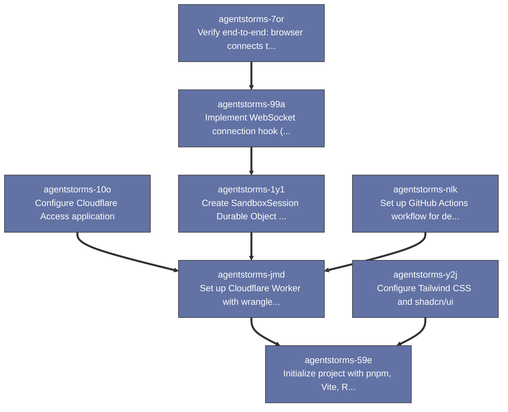

# Beads Export

*Generated: Tue, 30 Dec 2025 15:20:36 EST*

## Summary

| Metric | Count |
|--------|-------|
| **Total** | 8 |
| Open | 0 |
| In Progress | 0 |
| Blocked | 0 |
| Closed | 8 |

## Table of Contents

- [⚫ agentstorms-7or Verify end-to-end: browser connects to DO](#agentstorms-7or)
- [⚫ agentstorms-99a Implement WebSocket connection hook (useWebSocket)](#agentstorms-99a)
- [⚫ agentstorms-1y1 Create SandboxSession Durable Object skeleton](#agentstorms-1y1)
- [⚫ agentstorms-jmd Set up Cloudflare Worker with wrangler.toml](#agentstorms-jmd)
- [⚫ agentstorms-y2j Configure Tailwind CSS and shadcn/ui](#agentstorms-y2j)
- [⚫ agentstorms-59e Initialize project with pnpm, Vite, React, TanStack Router](#agentstorms-59e)
- [⚫ agentstorms-nlk Set up GitHub Actions workflow for deploy](#agentstorms-nlk)
- [⚫ agentstorms-10o Configure Cloudflare Access application](#agentstorms-10o)

---

## Dependency Graph

---

## 📋 agentstorms-7or Verify end-to-end: browser connects to DO

| Property | Value |
|----------|-------|
| **Type** | 📋 task |
| **Priority** | ⚡ High (P1) |
| **Status** | ⚫ closed |
| **Created** | 2025-12-29 12:25 |
| **Updated** | 2025-12-29 15:34 |
| **Closed** | 2025-12-29 15:34 |

### Description

LOCAL integration milestone: pnpm dev + pnpm dev:worker running, browser loads SPA, establishes WebSocket to DO via wrangler dev, sends test message, receives response. No deploy required - this verifies the development setup works.

### Dependencies

- ⛔ **blocks**: `agentstorms-99a`

---

## 📋 agentstorms-99a Implement WebSocket connection hook (useWebSocket)

| Property | Value |
|----------|-------|
| **Type** | 📋 task |
| **Priority** | ⚡ High (P1) |
| **Status** | ⚫ closed |
| **Created** | 2025-12-29 12:25 |
| **Updated** | 2025-12-29 13:17 |
| **Closed** | 2025-12-29 13:17 |

### Description

React hook for DO WebSocket connection. Handle connect/disconnect, message send/receive, and hydrate Zustand store from DO state. No reconnection logic in v1.

### Dependencies

- ⛔ **blocks**: `agentstorms-1y1`

---

## 📋 agentstorms-1y1 Create SandboxSession Durable Object skeleton

| Property | Value |
|----------|-------|
| **Type** | 📋 task |
| **Priority** | ⚡ High (P1) |
| **Status** | ⚫ closed |
| **Created** | 2025-12-29 12:25 |
| **Updated** | 2025-12-29 13:14 |
| **Closed** | 2025-12-29 13:14 |

### Description

Implement DO class with WebSocket handler, basic state storage (SQLite), and message protocol types. No AI integration yet - just connection handling and state persistence.

### Dependencies

- ⛔ **blocks**: `agentstorms-jmd`

---

## 📋 agentstorms-jmd Set up Cloudflare Worker with wrangler.toml

| Property | Value |
|----------|-------|
| **Type** | 📋 task |
| **Priority** | ⚡ High (P1) |
| **Status** | ⚫ closed |
| **Created** | 2025-12-29 12:24 |
| **Updated** | 2025-12-29 13:11 |
| **Closed** | 2025-12-29 13:11 |

### Description

Configure Worker entry point and static assets. Use [assets] block for SPA serving. Set up DO binding for SandboxSession. Single Worker hosts both frontend and API.

### Dependencies

- ⛔ **blocks**: `agentstorms-59e`

---

## 📋 agentstorms-y2j Configure Tailwind CSS and shadcn/ui

| Property | Value |
|----------|-------|
| **Type** | 📋 task |
| **Priority** | ⚡ High (P1) |
| **Status** | ⚫ closed |
| **Created** | 2025-12-29 12:24 |
| **Updated** | 2025-12-30 11:40 |
| **Closed** | 2025-12-30 11:40 |

### Description

Set up styling foundation: Tailwind v4 with OKLCH colors, shadcn/ui components, JetBrains Mono font. Follow STYLE_GUIDE.md Mira style (sharp corners, stone grays, emerald accent).

### Dependencies

- ⛔ **blocks**: `agentstorms-59e`

---

## 📋 agentstorms-59e Initialize project with pnpm, Vite, React, TanStack Router

| Property | Value |
|----------|-------|
| **Type** | 📋 task |
| **Priority** | ⚡ High (P1) |
| **Status** | ⚫ closed |
| **Created** | 2025-12-29 12:24 |
| **Updated** | 2025-12-29 13:07 |
| **Closed** | 2025-12-29 13:07 |

### Description

Scaffold the monorepo: pnpm init, Vite with React/TypeScript, TanStack Router with file-based routes (/, /session/$sessionId), basic tsconfig. Creates src/ structure from poc.md file layout.

---

## 📋 agentstorms-nlk Set up GitHub Actions workflow for deploy

| Property | Value |
|----------|-------|
| **Type** | 📋 task |
| **Priority** | 🔹 Medium (P2) |
| **Status** | ⚫ closed |
| **Created** | 2025-12-29 12:25 |
| **Updated** | 2025-12-30 11:41 |
| **Closed** | 2025-12-30 11:41 |

### Description

CI/CD pipeline: on push to main, build Vite app and deploy Worker + assets to Cloudflare. Requires CLOUDFLARE_API_TOKEN and CLOUDFLARE_ACCOUNT_ID secrets. Acceptance: push to main results in successful deploy, app accessible at production URL.

### Dependencies

- ⛔ **blocks**: `agentstorms-jmd`

---

## 📋 agentstorms-10o Configure Cloudflare Access application

| Property | Value |
|----------|-------|
| **Type** | 📋 task |
| **Priority** | 🔹 Medium (P2) |
| **Status** | ⚫ closed |
| **Created** | 2025-12-29 12:25 |
| **Updated** | 2025-12-30 11:41 |
| **Closed** | 2025-12-30 11:41 |

### Description

Set up CF Access application in dashboard to protect the Worker. Whitelist specific email addresses. Can be configured once wrangler.toml defines the Worker name/route (don't need to wait for actual deployment).

### Dependencies

- ⛔ **blocks**: `agentstorms-jmd`

---

